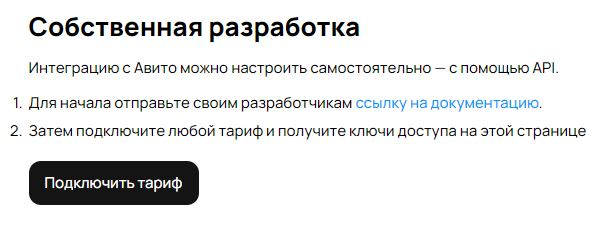
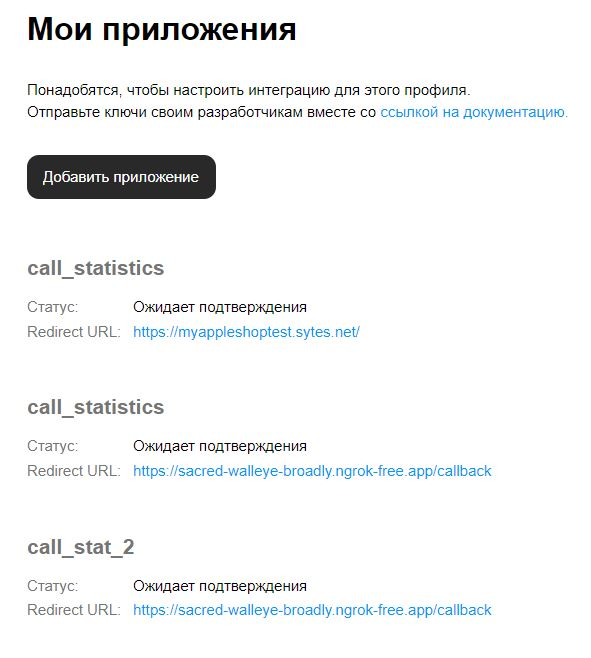
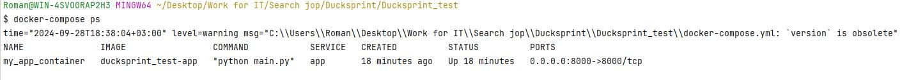
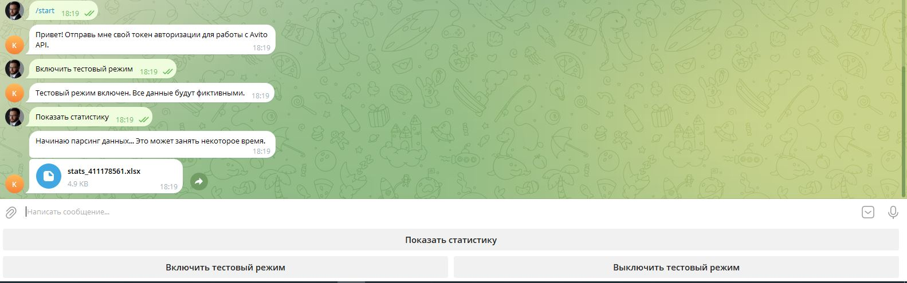
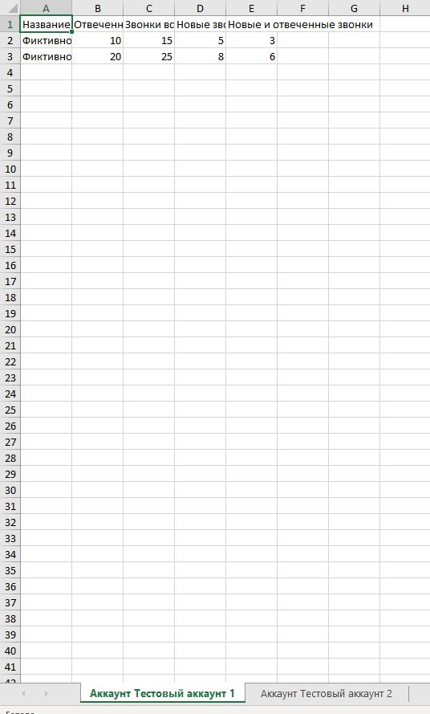
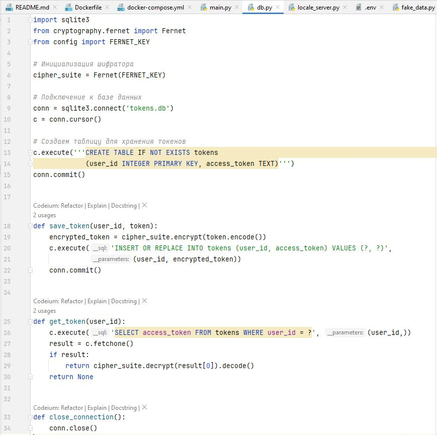
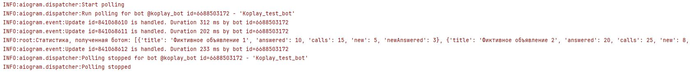

# Тестовое задание от Ducksprint

### Техническое задание (ТЗ) для разработки Telegram-бота

#### 1. Общая информация:
   - **Название проекта**: Telegram-бот для статистики звонков по объявлениям Avito
   - **Цель**: Разработка Telegram-бота, который принимает токен авторизации от пользователя, 
парсит объявления и предоставляет статистику по звонкам в формате XLSX.

#### 2. Функциональные требования:
   - **Операционные команды бота**:
     1. **Команда для отправки токена**: 
        - Пользователь отправляет токен авторизации.
        - Пользователь может добавить несколько токенов авторизации
        - Бот сохраняет токен для дальнейшего использования.
     
     2. **Кнопка парсинга**:
        - Пользователь нажимает кнопку "Показать статистику".
        - Бот запускает процесс парсинга объявлений, используя токены авторизации.

   - **Парсинг объявлений**:
     - Бот должен сделать запрос к API, чтобы получить список объявлений пользователя по всем 
     кабинетам. (https://api.avito.ru/core/v1/items)
     - Для каждого объявления бот должен сделать отдельный запрос для получения статистики звонков. 
     (https://api.avito.ru/core/v1/accounts/{user_id}/calls/stats/)
     - Информация включает следующие поля:
       - **answered**: integer (Отвеченные звонки)
       - **calls**: integer (Звонки всего)
       - **date**: string (Дата в формате YYYY-MM-DD)
       - **new**: integer (Новые звонки)
       - **newAnswered**: integer (Новые и одновременно отвеченные звонки)

   - **Формирование отчета в формате XLSX**:
     - Бот должен создать файл XLSX, где:
       - Каждый личный кабинет пользователя представлен на отдельном листе.
       - Каждая строка на листе соответствует каждому объявлению в кабинете.
       - Колонки должны включать поля:
         - Название объявления
         - Отвеченные звонки
         - Звонки всего
         - Новые звонки
         - Новые и одновременно отвеченные звонки
     - Бот должен уведомить пользователя об успешном завершении парсинга.
     - Бот должен отправить файл XLSX пользователю как ответ на команду парсинга.

#### 3. Нефункциональные требования:
   - **Безопасность**: 
     - Токены авторизации должны храниться безопасно и не должны быть доступны другим пользователям.

   - **Производительность**:
     - Бот должен обрабатывать запросы и формировать отчеты асинхронно, чтобы минимизировать время 
     ожидания пользователя.

   - **Тестирование**:
     - Предоставить тестовый режим работы бота для отладки (например, с использованием фиктивных 
     данных).

#### 4. Технические детали:
   - **Язык разработки**: Python
   - **Код должен быть асинхронным** (рекомендуется использовать библиотеки `aiohttp` для 
асинхронных запросов и `asyncio`).
- **Контейнеризация** проект должен быть контейнеризирован через docker-compose.

#### 5. Дизайн интерфейса:
   - Простой интерфейс, основанный на кнопках.
   - Кнопка "Показать статистику" должна быть четко видна и доступна после отправки токена.
   - В случае ошибки парсинга, бот должен предоставлять пользователю ясное описание проблемы.

#### 6. Сроки реализации:
   - **Предполагаемый срок выполнения проекта**: 1 день

## Решение
### Получение токена авторизации

#### Ngrok

https://it-solution.kdb24.ru/article/read/0860fe1237944d8891f223132633e3ba/
Запуск ngrok
```
./ngrok.exe config add-authtoken your_auth_token
```
```
./ngrok.exe http --domain=yourdomain.ngrok-free.app 8000
```

#### Avito API

Чтобы получить доступ к API Avito: 

- оплатить любой тариф на авито, чтобы получить доступ к индивидуальной авторизации;



- нужно быть партнером Авито(это для регистрации своего приложения)
(**регистрируют в течение двух дней**);



Ссылка на подробное описание, как получить токен авторизации: https://developers.avito.ru/api-catalog
Используйте:locale_server.py для получения токена авторизации

## Как запустить проект в Docker

### Предварительные требования

Перед тем как начать, убедитесь, что у вас установлены следующие программы:

- [Docker](https://docs.docker.com/get-docker/)
- [Docker Compose](https://docs.docker.com/compose/install/)

### Шаги для запуска

#### 1. Клонируйте репозиторий

Откройте терминал или командную строку и выполните команду для клонирования репозитория:

```bash
git clone https://github.com/RomanKostikov/Ducksprint_test.git
```

#### 2. Перейдите в директорию проекта

Перейдите в директорию проекта:
```bash
cd <название_вашего_проекта>
```

#### 3. Настройте файл .env

Создайте файл .env в корне проекта на основе следующего шаблона env

#### 4. Соберите Docker-контейнеры
Запустите Docker Compose для сборки и запуска контейнеров:
```bash
docker-compose up --build
```
Эта команда соберет контейнер вашего приложения.

#### 5. Проверьте, что контейнер работает
Для проверки статуса контейнеров выполните команду:
```bash
docker-compose ps
```
Вы должны увидеть что-то похожее:



### Скриншоты

Приложение протестировано с фиктивными данными:





Добавлена логика шифрования токенов авторизации:



Добавлено логирование:

